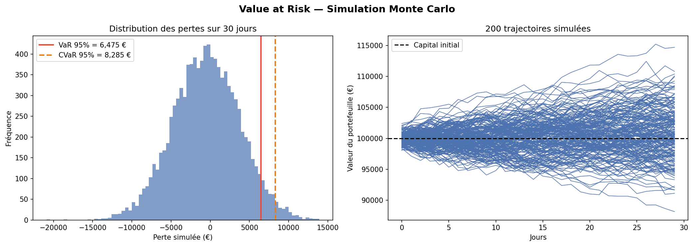

# Value at Risk — Monte Carlo Simulation

Estimation de la VaR et CVaR à 95% sur un portefeuille S&P 500 / CAC 40
via simulation de Monte Carlo en Python.

## Méthodologie

- Données réelles téléchargées via `yfinance` (2 ans d'historique)
- Rendements log-normaux multivariés avec matrice de covariance réelle
- Portefeuille pondéré : 60% S&P 500 / 40% CAC 40
- 10 000 scénarios simulés sur un horizon de 30 jours
- Calcul de la VaR 95% et de la CVaR 95% (Expected Shortfall)

## Résultats

| Métrique | Valeur |
|---|---|
| Capital simulé | 100 000 € |
| VaR 95% à 30j | 6 475 € |
| CVaR 95% à 30j | 8 285 € |
| Corrélation S&P / CAC | 0.28 |
| Perte maximale simulée | 13 908 € |

## Visualisations



## Stack technique

Python · NumPy · Pandas · Matplotlib · yfinance

## Lancer le projet
```bash
pip install -r requirements.txt
python main.py
```

## Limites du modèle

- Hypothèse de normalité des rendements (fat tails ignorés)
- Corrélation supposée stable dans le temps
- Basé sur données historiques (pas prédictif)
